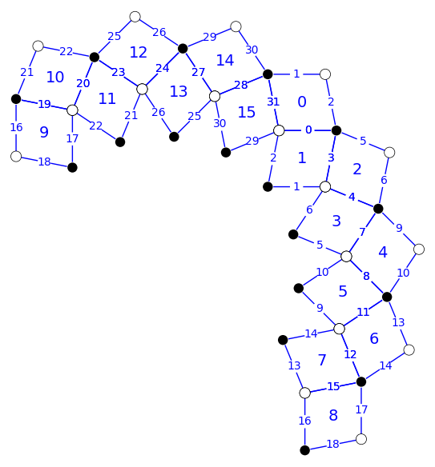

# Discrete Riemann Surfaces

This code contains basic data structures for discrete Riemann surfaces in [sage](https://www.sagemath.org/).

Implemented are

 - basic construction methods, examples, visualization,
 - homology, cohomology,
 - intersection numbers of cycles, intersection forms,
 - complex structures, complex parallelogram structures,
 - spin structures, and winding numbers around them,
 - Johnson form,
 - Arf invariant, and
 - holomorphic spinors.

### Contents

 - *discrete-riemann-surfaces.sage* - Source code

### Example

sage: xOrigami(8).show()

 
### Authors

Felix Günther, Benjamin Matschke.

### License

Creative Commons BY-NC 4.0.
